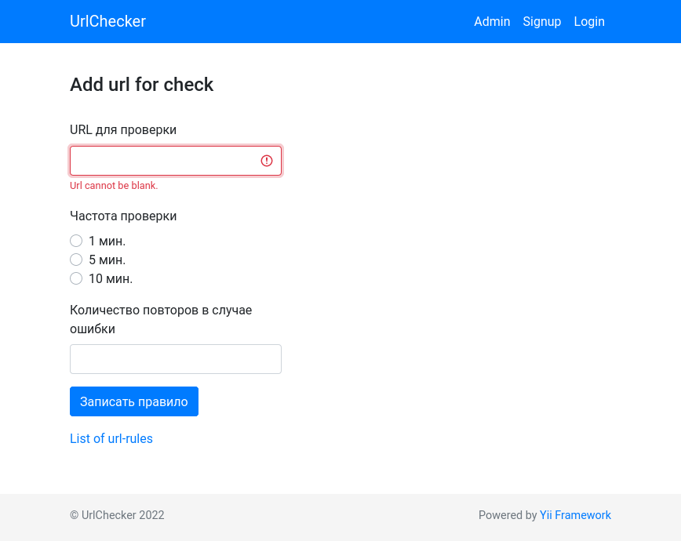
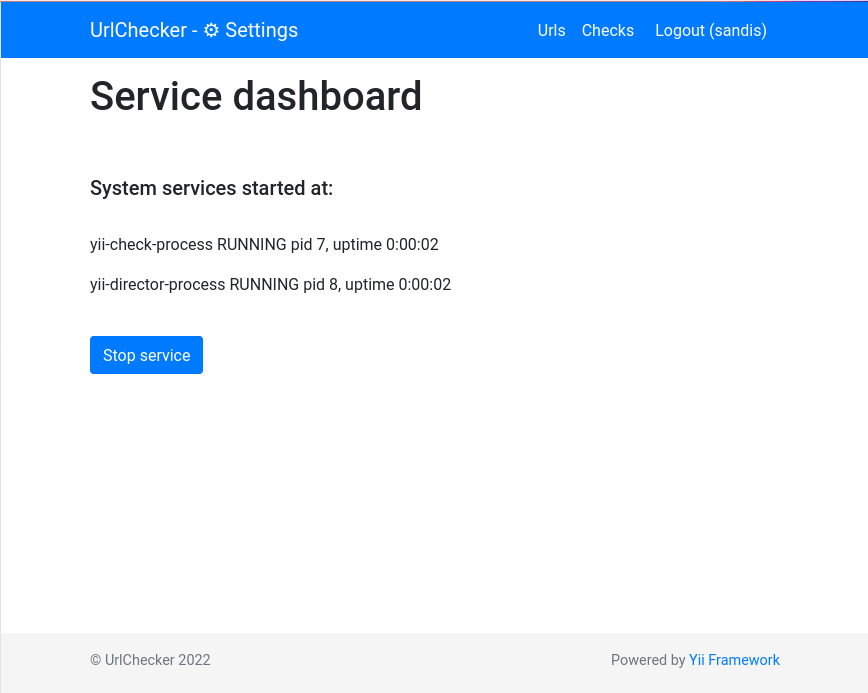
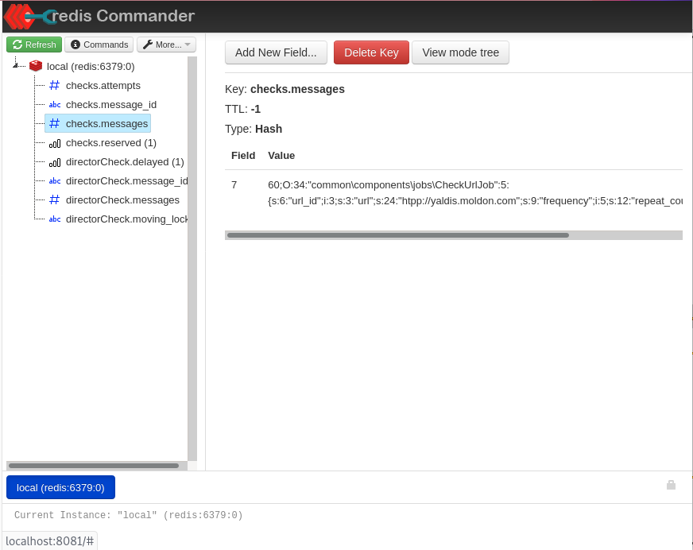
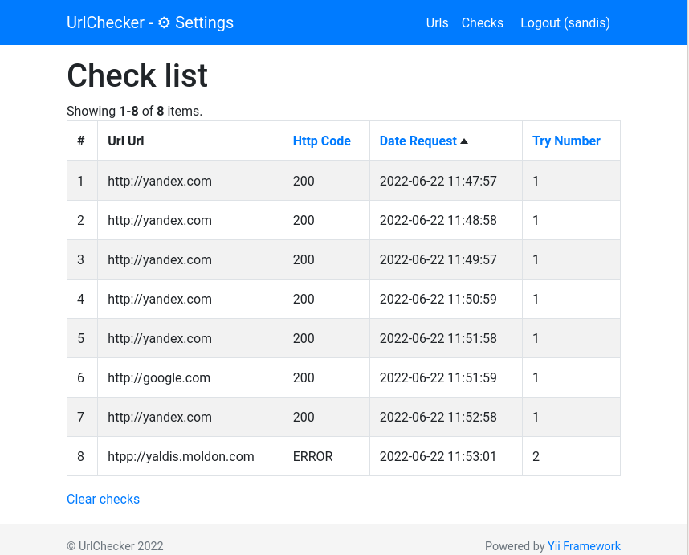

# CheckUrls

** YII2 сервис для проверки доступных урлов. В рамках тренировки. **

Установка
------------
0. Если не установлен docker и docker-composer, произведите действия соласно официальной инструкции [docs.docker.com](https://docs.docker.com/engine/install/ubuntu/)
1. Скопируйте или скачайте данный репозитарий
2. Установите и настройте docker окружение
   ```angular2html
   cd docker && ./run.sh
   ```
3. Скачайте пакеты и зависимости
   ```
   docker exec -ti -u root checker_url_php composer install
   ```
4. Осуществите миграции
      ```angular2html
   docker exec -ti -u root checker_url_php php yii migrate
   ```

5. Раскоментируйте строчку
   ```angular2html
   CMD ["/usr/bin/supervisord", "-c", "/etc/supervisor/supervisord.conf"]
   ```
   в файле docker/services/php/Dockerfile


   
6. Перезапустите проект
   ```angular2html
   ./run.sh
   ```

Управляйте запуском с помощью скриптов run.sh и stop.sh

Доступы
------------
1. site localhost
2. MySql localhost:3306
```angular2html
MYSQL_DATABASE=db_project
MYSQL_USER=user
MYSQL_PASSWORD=password
MYSQL_ROOT_PASSWORD=root
```
3. Redis localhost:6379
4. Redis Commander localhost:8081

Известные проблемы
------------
//= Ошибка прав, выполните команду непосрдственно из докера
```angular2html
docker exec -ti -u root checker_url_php chown -R www-data /code
```
Скриншоты
------------



